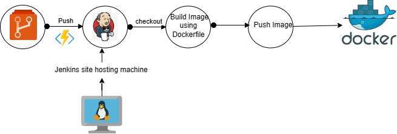
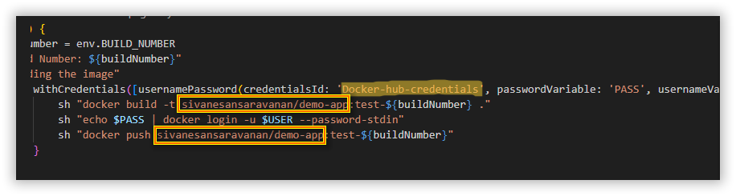
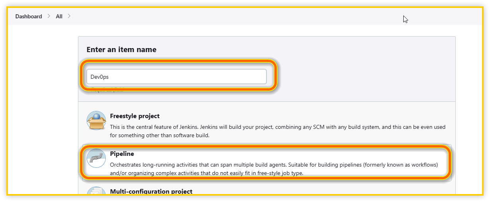
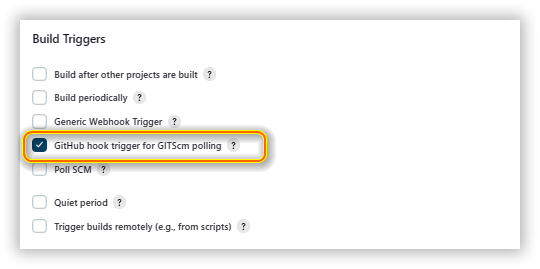
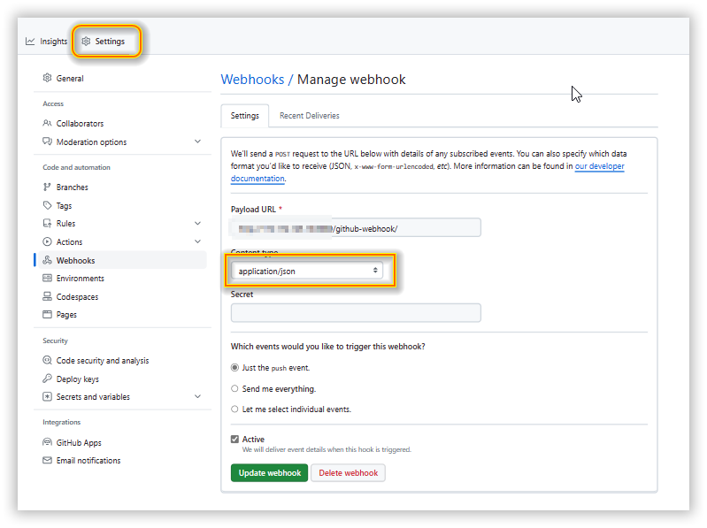
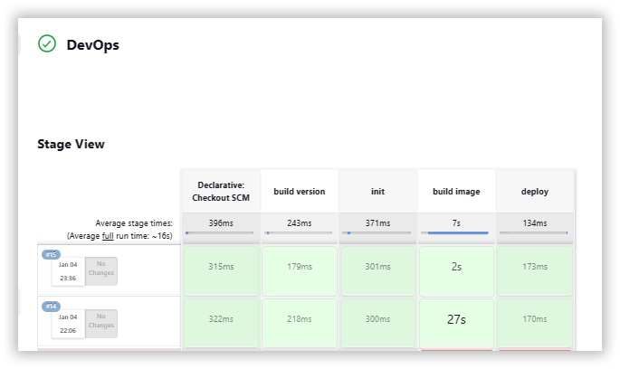
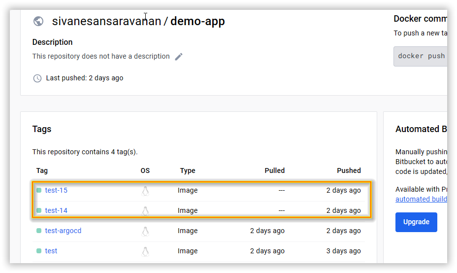

# CI/CD Project for build and push the docker image using Jenkins

This section explains about how to build and push the sample dotnet application using jenkins.



## Prerequisites:

1. Local machine with WSL(Ubuntu 20.04) / Cloud virutal machine.
2. [Docker Application](https://www.digitalocean.com/community/tutorials/how-to-install-and-use-docker-on-ubuntu-20-04)
3. GitHub account
4. Docker Hub Repository account   
## Steps and deployment

1. Use the below command to deploy the jenkins with mounted docker.

    ```sh
    docker run --name jenkins /
    -p 8080:8080 /
    -p 80:80 /
    -v jenkins_home:/var/jenkins_home /
    -v /var/run/docker.sock:/var/run/docker.sock /
    -v $(which docker):/usr/bin/docker /
    -d jenkins/jenkins:lts
    ```
    Jenkins Docker Image: [https://hub.docker.com/r/jenkins/jenkins](https://hub.docker.com/r/jenkins/jenkins)
   > Note : Once container is created then site is accessible through `http://localhost:8080` or `http://ip-address:8080`
2. Enter as root and modify docker.sock permission using below command.

    ```sh
    docker exec -u 0 -it jenkins bash
    ```
    ```sh
    chmod 666 /var/run/docker.sock
    ```
    Now, the docker is accessible inside the jenkins container without any permission issue.
3. Login into the jenkins site and create the crediential for `Github account` and `Docker hub repository`.

    print the initialisation password for Jenkins site
    ```sh
    cat /var/lib/docker/volumes/jenkins_home/_data/secrets/initialAdminPassword
    ```
4. Checkout the below branch <br>
   Repository => https://github.com/ssiva9040/Devops-Project/tree/jenkins-ci-cd-dotnet

   This branch contains sample Dotnet application source code, Jenkins file, groovy script and Dockerfile.

5. Enter your Docker Hub repository saved credential name in groovy script and correct image repository.
    

6. Once all the changes done, commit your own repository.

7. Now, go to the jenkins site and create the pipeline project.

    
    
8. In Build triggers select the `GitHub hook trigger for GITScm polling`.
    
9. From Pipeline section and enter the below details.
    * Definition - Pipeline script from SCM.
    * SCM - git
    * Respository URL - Enter the Repository URL
    * Branches to build - Enter the correct branch.
    * script path - Jenkinsfile
    

10. Now Save the project.
11. Navigate to the saved CI/CD GitHub repository in browser for create the GitHub Hook.
    * Payload URL - Jenkins URL/github-webhook/ <br>
    Enter the jenkins hosted URL with github-webhook/
    Example - http://example.com/github-webhook/ 
    * Content type - application/json

         
12. Now CI/CD setup is completed, Whenever the changes commit in the GitHub branch, jenkins job automatically start to build and push the image to docker hub repository.
    

    Docker Hub repository
    
